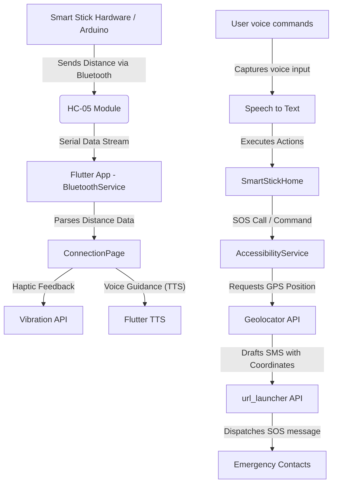

# 🦯 SmartStick Mobile App

[](https://flutter.dev)
[](https://dart.dev)
[](https://opensource.org/licenses/MIT)
[](https://flutter.dev/accessibility)

A Flutter-based companion application designed specifically to empower visually impaired individuals. It integrates seamlessly with smart stick hardware to provide screen-free navigation, real-time obstacle alerts, voice-controlled systems, and emergency SOS services.

---

## 📸 System Architecture & Data Flow

Below is the workflow showing how the Flutter app, hardware components, and mobile services interact:



---

## ✨ Key Features

### 1. 🎤 Voice-Activated Login & Session Management
- **Screen-free login**: Users simply tap the large microphone button and say their name (e.g., "Girish", "Abhiram").
- **Voice validation**: Recognizes speech inputs, matches them against registered users, and initializes their custom session with appropriate phone details automatically.

### 2. 🔵 HC-05 Bluetooth Integration
- Scans and automatically connects to the smart stick's paired Bluetooth module (e.g., `HC-05`).
- Listens to a continuous serial data stream coming from the smart stick's hardware sensors.

### 3. 🚨 One-Touch & Voice-Activated SOS Emergency Alerts
- Triggers when the user taps the prominent red SOS button or says **"SOS"** / **"Emergency"**.
- Automatically fetches accurate GPS coordinates using device location sensors.
- Builds a precise Google Maps redirection link.
- Automatically launches the messaging client with the location payload pre-filled to notify the registered emergency contacts.

### 4. 🔊 Obstacle Warning System (Dynamic Alerts)
Analyzes distance data streamed via Bluetooth and triggers immediate multimodal feedback:
- **Critical Warning (< 20 cm)**: Spoken voice alert *"Stop! Obstacle very close"* and intense error vibration.
- **Caution Warning (20 - 50 cm)**: Spoken warning *"Caution. Obstacle"* and cautionary vibration.
- **Path Clear (>= 50 cm)**: Speaks *"Path clear"* and triggers success haptic patterns.

---

## 🛠️ Project Structure

```text
lib/                  
└── blind_stick/
    ├── main.dart                  # Entry point for blind stick module
    ├── login_page.dart            # Speech-to-text login screen with mic interaction
    ├── home.dart                  # Main dashboard hosting voice assistant loops
    ├── connection_page.dart       # Live Bluetooth status & sensor stream visualizations
    ├── accessibility_service.dart # Handles TTS engines, custom haptics, and SOS workflows
    ├── bluetooth_service.dart     # Manages HC-05 connection protocols and stream buffers
    └── user_session.dart          # Static session model to track current user profiles
```

---

## 📦 Required Permissions

To run this application seamlessly, the following permissions must be enabled on the target device:
- **Location Services**: Used by the `geolocator` package to generate Google Maps coordinates during emergency situations.
- **Bluetooth & Admin Permissions**: Required to search, scan, pair, and stream serial data from the HC-05 module.
- **Microphone & Speech Recognition**: Utilized by the `speech_to_text` library for the login screen and voice control modules.
- **Vibration/Haptic Control**: Allows the app to provide customized vibration alarms for different distance ranges.
- **SMS/Telephony Services**: Enables drafting and opening the emergency text messaging service to alert caretakers.

---

## 🚀 Getting Started

### Prerequisites
Before launching the application, ensure you have:
1. Installed [Flutter SDK](https://docs.flutter.dev/get-started/install) (compatible with `sdk: ^3.10.7`).
2. Enabled Bluetooth on your mobile device.
3. Paired your phone with the smart stick's Bluetooth module (usually named `HC-05`) in system settings.

### Installation & Run

1. Clone this repository to your local workspace:
   ```bash
   git clone https://github.com/girishnalkar/Blind-stick-mobile-app.git
   cd Blind-stick-mobile-app
   ```

2. Retrieve dependencies:
   ```bash
   flutter pub get
   ```

3. Connect a physical Android/iOS device (recommended since emulator platforms do not support Bluetooth hardware or haptic motors fully).

4. Compile and launch:
   ```bash
   flutter run
   ```

---

## 🔌 Hardware Compatibility

The app is built to work out of the box with standard smart stick configurations:
- **Microcontroller**: Arduino Uno, Arduino Nano, ESP32, or similar.
- **Bluetooth Module**: HC-05 / HC-06 Transceiver.
- **Distance Sensor**: HC-SR04 Ultrasonic Distance Sensor.
- **Alert Trigger**: Sends float/integer values corresponding to distance (in cm) terminated by a newline (`\n`).


